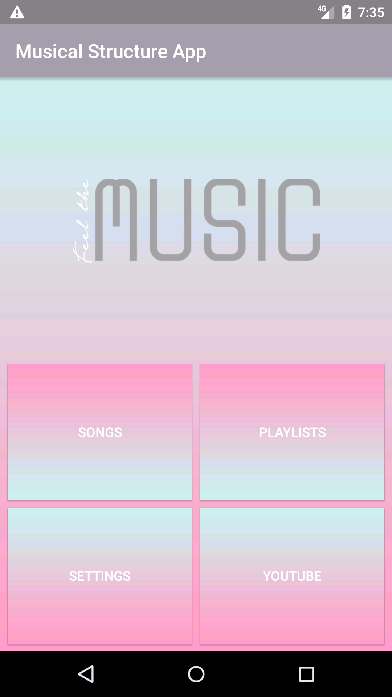

# Musical-Structure-App

Musical Structure App for Android Basics by Google Nanodegree Program

## The required components for this project are:

• 2 to 6 Activities that are linked via explicit intents  
• A custom class storing information about each song. Each instance of the custom class must contain at least 2 states  
 &nbsp; (e.g. Song Name,Artist Name). Images (e.g. Album Art) are not required but allowed.  
•A data structure, such as an ArrayList that would store Instances of the custom class. These instances should be retrieved and displayed in a ListView or GridView via an Adapter. 

## Screenshots

&nbsp&nbsp&nbsp&nbsp&nbsp&nbsp&nbsp&nbsp&nbsp&nbsp&nbsp&nbsp;

 

 
  
  
 
 

&nbsp&nbsp&nbsp&nbsp&nbsp&nbsp&nbsp&nbsp&nbsp&nbsp&nbsp&nbsp&nbsp&nbsp&nbsp&nbsp&nbsp&nbsp&nbsp&nbsp;

 

